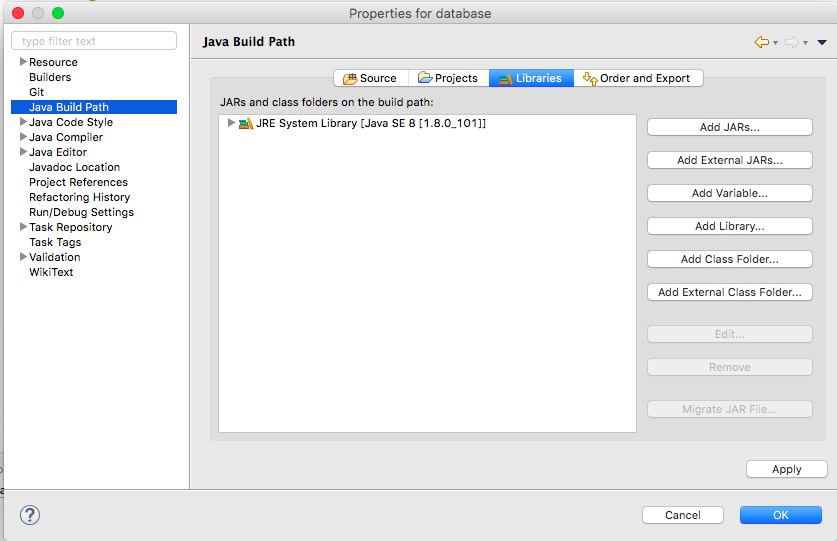
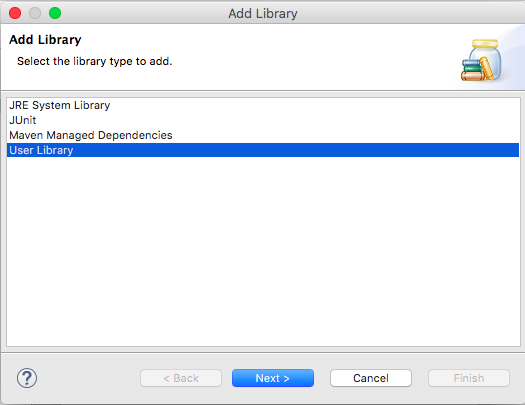
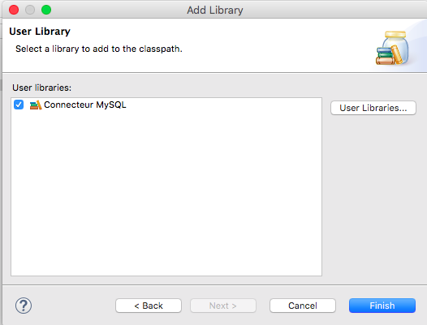

# Accès à une base de données

## Introduction

Nous allons utiliser JDBC pour accéder à une base de données. Il existe d'autres librairies qui permettent l'accès aux bases de données, avec des fonctionnalités plus avancées (par exemple JPA ou Hibernate).

Cependant JDBC est l'API de bas niveau qui est utilisée par toutes celles de plus haut niveau.

Nous allons donc découvrir le fonctionnement de cette API et voir comment on peut *mapper* (c'est-à-dire associer) les entrées d'une base de données avec les membres d'une classe. Ceci revient à faire correspondre les valeurs d'une table aux attributs d'une classe.


## Accès à une base MySQL

### Installation

Pour commencer, vous allez écrire le programme suivant et le lancer:

```java
package fr.greta.dwm2.database;

import java.sql.*;

public class Demo {
	public static void main(String[] args) {
		//Commençons par charger le pilote:
		try {
			Class.forName("com.mysql.jdbc.Driver");
		} catch (ClassNotFoundException e) {
			e.printStackTrace();
		}

	}
}
```

Lancez ce programme. Vous constatez un erreur et c'est normal !

Ce programme ne va pas marcher car il lui manque un connecteur que vous allez télécharger [sur le site de MySQL](https://dev.mysql.com/downloads/connector/j/)

Choisissez une des deux archives, téléchargez-la et décompressez-la.

Ce connecteur est une librairie qu'il faut ajouter à votre projet.

Pour cela, ouvrez les propriétés du projet (bouton droit et `Properties`) et allez sur `Java Build Path` puis `Libraries`



Cliquez sur `Add Library...`



Sélectionnez `User Library` et cliquez sur `Next`


Cliquez sur `User Libraries...`


Cliquez sur `New...` et entrez comme nom : `Connecteur MySQL`

Sélectionnez la nouvelle librairie et cliquez sur `Add External JARs...`

Sélectionnez le fichier `mysql-connector-java-X.Y.ZZ-bin.jar` qui était dans l'archive puis validez les modifications


Cliquez sur `Source attachment` puis sur `Edit...`


Choisissez `External location` puis `External Folder...` et sélectionnez le répertoire `src` qui est dans le même dossier que le fichier JAR précédent.

Validez toutes les modifications pour sortir des préférences



Cliquez sur `Finish` puis sur `OK`

Relancez le programme: aucune erreur n'apparaît, vous avez chargé un pilote pour le connecteur MySQL.

### Utilisation

#### Création d'une base de données de test

Vous pouvez soit utiliser [ce fichier](demojava.sql), soit suivre les instructions ci-dessous.

```sql
mysql> create database demojava ;
Database changed

mysql> show tables ;
Empty set (0.00 sec)
```


Nous allons maintenant définir les privilèges d'accès à la base de données:

```sql
mysql>
CREATE USER 'demouser'@'%' IDENTIFIED BY 'MotDePasse';

mysql> GRANT ALL PRIVILEGES ON demojava.* TO "demouser"@"%" IDENTIFIED BY "MotDePasse";
Query OK, 0 rows affected (0.00 sec)

```

Le `%` signifie que n'importe quelle machine pourra se connecter, ce qui n'est pas forcément une bonne chose.

On pourra le remplacer soit par l'IP de l'hôte si elle est fixe, soit par `localhost`.


Puis créer la table de démonstration:

```sql
mysql> create table personne (nom varchar(64), prenom varchar(64), dnaissance date);
Query OK, 0 rows affected (0.01 sec)

mysql> show tables ;
+--------------------+
| Tables_in_demojava |
+--------------------+
| personne           |
+--------------------+
1 row in set (0.00 sec)
```


On peut voir la définition de la table avec la commande suivante:
```sql
mysql> describe personne;
+------------+-------------+------+-----+---------+-------+
| Field      | Type        | Null | Key | Default | Extra |
+------------+-------------+------+-----+---------+-------+
| nom        | varchar(64) | YES  |     | NULL    |       |
| prenom     | varchar(64) | YES  |     | NULL    |       |
| dnaissance | date        | YES  |     | NULL    |       |
+------------+-------------+------+-----+---------+-------+
3 rows in set (0.01 sec)
```

On ajoute une entrée:
```sql
mysql> insert into personne values ('Luther King','Martin','1929-01-15');
Query OK, 1 row affected (0.01 sec)

mysql> select * from personne ;
+-------------+--------+------------+
| nom         | prenom | dnaissance |
+-------------+--------+------------+
| Luther King | Martin | 1929-01-15 |
+-------------+--------+------------+
1 row in set (0.00 sec)

```


#### Connecteur

Observez et analysez cet exemple :

```java
package fr.greta.dwm2.database;

import java.sql.*;

public class ConnectionMySQL {
	private Connection connection = null;
	private String user, password, host;

	private static boolean driverLoaded = false;

	public static boolean isDriverLoaded(){
		return driverLoaded;
	}

	public static void init() throws ClassNotFoundException, IllegalAccessException, InstantiationException{
		if(!driverLoaded){
			//Chargement du pilote
			Class.forName("com.mysql.jdbc.Driver").newInstance();
			driverLoaded = true;
		}
	}

	public ConnectionMySQL() {
		if(!driverLoaded){
			throw new IllegalStateException("Cannot instantiate if driver is not loaded. Please call "+getClass().getName()+".init() method before invoking this constructor.");
		}
	}

	public ConnectionMySQL(String host, String user, String password) {
		this();
		this.host = host;
		this.user = user;
		this.password = password;
	}

	public void connect() throws SQLException{
		//Connexion a la base de données
		System.out.println("Connexion à la base de données");

		String dBurl = "jdbc:mysql://"+host+"/demojava";
		connection = DriverManager.getConnection(dBurl, user, password);

		/*
		 * Autre utilisation possible:
			String dBurl = "jdbc:mysql://"+host+"/demojava"
							+ "?user="+user+"&password="+password;
			connection = DriverManager.getConnection(dBurl);				
		 */

	}
	public ResultSet execute(String requete) throws SQLException{
		System.out.println("creation et execution de la requête :"+requete);
		Statement stmt = connection.createStatement();
		return stmt.executeQuery(requete);
	}

	public void close() throws SQLException{
		connection.close();
	}
}
```

Méthode `main` :

```java
package fr.greta.dwm2.database;

import java.sql.ResultSet;
import java.sql.ResultSetMetaData;
import java.sql.SQLException;

public class AfficherTablePersonne {

	public void afficherDonnees(ResultSet resultats) throws SQLException{
		System.out.println("Parcours des donnees retournees");
		ResultSetMetaData rsmd = resultats.getMetaData();
		int nbCols = rsmd.getColumnCount();
		boolean contientDAutresDonnees = resultats.next();

		for (int i = 1; i <= nbCols; i++) {
			if(i > 1) {
				System.out.print( " | ");
			}
			System.out.print(rsmd.getColumnLabel(i));
		}
		System.out.println();

		while (contientDAutresDonnees) {
			for (int i = 1; i <= nbCols; i++){
				if(i > 1) {
					System.out.print( " | ");
				}
				System.out.print(resultats.getString(i));
			}
			System.out.println();
			contientDAutresDonnees = resultats.next();
		}

		resultats.close();
	}

	public static void main(java.lang.String[] args) {
		try {
			ConnectionMySQL.init();			
		} catch (ClassNotFoundException | IllegalAccessException | InstantiationException e) {
			System.err.println("La librairie n'est pas disponible");
			System.exit(5);
		}


		AfficherTablePersonne atp = new AfficherTablePersonne();
		ConnectionMySQL connecteur = new ConnectionMySQL("lamp.exemple.cesi", "demouser", "MotDePasse");
		try {
			connecteur.connect();

			ResultSet resultSet = connecteur.execute("SELECT * FROM personne");
			atp.afficherDonnees(resultSet);

			//Bonne pratique: fermer votre résultat
			resultSet.close();

			//Bonne pratique: fermer le connecteur
			connecteur.close();
		} catch (SQLException e) {
			e.printStackTrace();
		}
		System.exit(0);
	}
}
```


## Exercice

Créez une classe qui permette de stocker les résultats en lisant un `ResultSet` et un algorithme qui instancie une Personne pour chaque entrée de la base.


```java

public interface Personne{
  //...
  public String getNom();
  public String getPrenom();

  public Date getDateNaissance();
}

```
## Ecrire dans les bases de données

La classe suivante montre comment écrire dans une base de données:

```java
package fr.greta.dwm2.database.lecture;

import java.sql.SQLException;
import java.sql.Statement;
import java.text.SimpleDateFormat;
import java.util.InputMismatchException;
import java.util.List;
import java.util.Scanner;

import fr.greta.dwm2.database.ConnectionMySQL;
import fr.greta.dwm2.database.DateSimple;
import fr.greta.dwm2.database.Personne;
import fr.greta.dwm2.util.GestionMenu;

public class Ecriture {
	//INSERT INTO `personne`(`nom`, `prenom`, `dnaissance`) VALUES ('RABHI','Pierre','1938-05-29')

	public void remplir(ConnectionMySQL connecteur){
		//Nécessaire pour faire les insertions
		Statement stmt = null;
		try {
			connecteur.connect();
	        stmt = connecteur.getConnection().createStatement();
	        boolean continuer = true;
			while(continuer){
				String nom = GestionMenu.getInstance().getValeur("Entrez le nom:");
				String prenom = GestionMenu.getInstance().getValeur("Entrez le prénom:");
				DateSimple ds = null;
				while(ds == null){
					String date = GestionMenu.getInstance().getValeur("Entrez une date:");
					ds = DateSimple.checkDate(date);
				}
				inserer(stmt, nom, prenom, ds);
				String doitContinuer = GestionMenu.getInstance().getValeur("Continuer (o/n):");
				continuer = doitContinuer.equals("o");
			}
		} catch (SQLException e) {
			e.printStackTrace();
		}
		finally{
			if (stmt != null) {
				try {
					stmt.close();
				} catch (SQLException e) {
					System.err.println("Erreur à la sortie");
					e.printStackTrace();
				}
			}
		}
	}


	public void changerDate(ConnectionMySQL connecteur){
		//Nécessaire pour faire les insertions
		Statement stmt = null;
		try {
			connecteur.connect();
	        stmt = connecteur.getConnection().createStatement();
	        boolean continuer = true;
			while(continuer){
				String nom = GestionMenu.getInstance().getValeur("Entrez le nom:");
				String prenom = GestionMenu.getInstance().getValeur("Entrez le prénom:");
				DateSimple ds = null;
				while(ds == null){
					String date = GestionMenu.getInstance().getValeur("Entrez une date:");
					ds = DateSimple.checkDate(date);
				}
				inserer(stmt, nom, prenom, ds);
				String doitContinuer = GestionMenu.getInstance().getValeur("Continuer (o/n):");
				continuer = doitContinuer.equals("o");
			}
		} catch (SQLException e) {
			e.printStackTrace();
		}
		finally{
			if (stmt != null) {
				try {
					stmt.close();
				} catch (SQLException e) {
					System.err.println("Erreur à la sortie");
					e.printStackTrace();
				}
			}
		}
	}

	public void inserer(Statement stmt,
			String nom, String prenom, DateSimple date) throws SQLException{
		stmt.executeUpdate(
				"insert into personne " +
				"values('"+nom+"', '"+prenom+"', '"+date.getSqlRepresentation()+"')");
	}

	public static void main(String[] args) {
		try {
			ConnectionMySQL.init();			
		} catch (ClassNotFoundException | IllegalAccessException | InstantiationException e) {
			System.err.println("La librairie n'est pas disponible");
			System.exit(5);
		}


		//On peut continuer ici:
		ConnectionMySQL connecteur = new ConnectionMySQL("lamp.exemple.cesi", "demouser", "MotDePasse");
		Ecriture ins = new Ecriture();
		ins.remplir(connecteur);

	}
}

```

Le code source des classes qu'elle utilise est disponible [ici](exemples/database) :

* [GestionMenu.java](exemples/database/fr/greta/dwm2/util/GestionMenu.java)

* [DateSimple.java](exemples/database/fr/greta/dwm2/database/DateSimple.java)

Voir aussi cette page : [Retrieving and Modifying Values from Result Sets](http://docs.oracle.com/javase/tutorial/jdbc/basics/retrieving.html)


## Pour aller plus loin

Des exemples complets sur l'ensemble des fonctionnalités JDBC [sont disponibles ici](http://docs.oracle.com/javase/tutorial/jdbc/basics/index.html).
