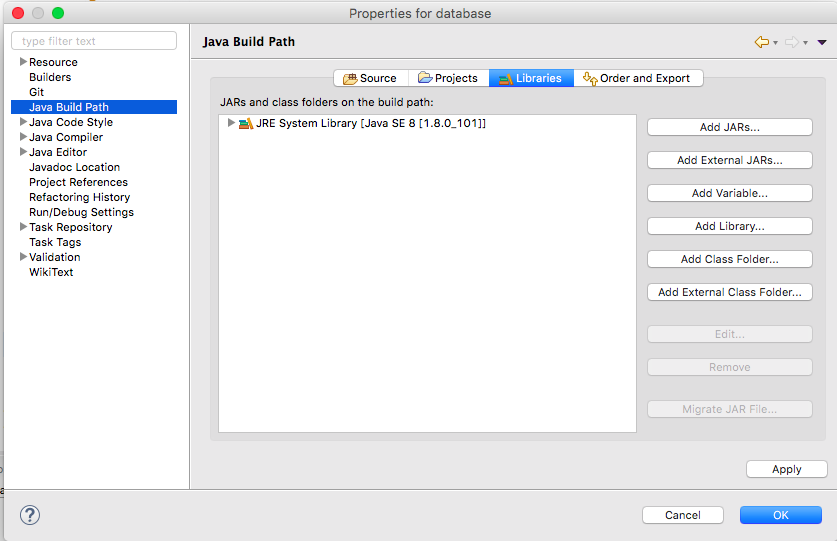
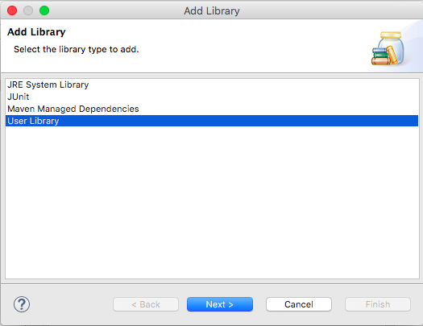
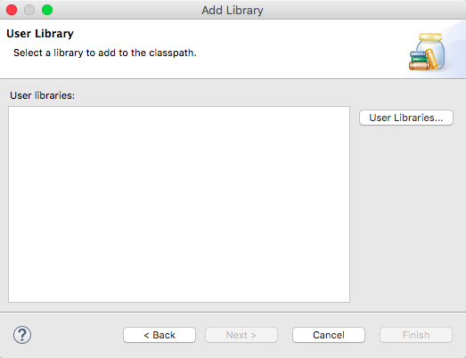
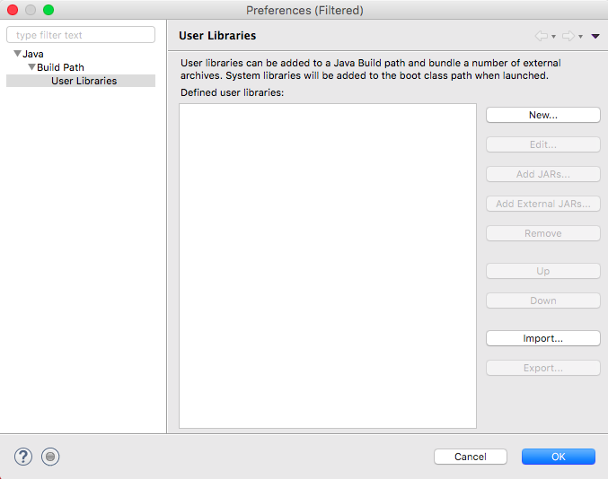
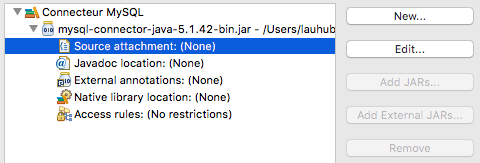
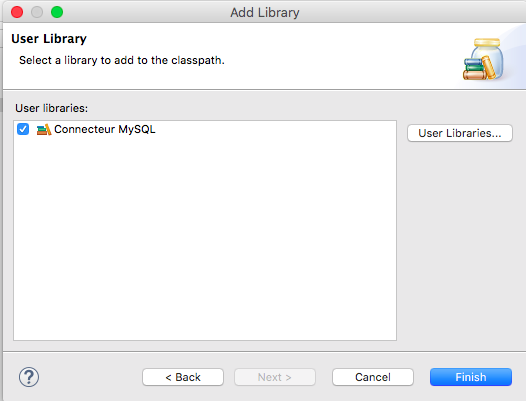

# Installation d'une librairie

## Sous Eclipse

### Installation du pilote MySQL

#### Test de l'installation
Une bonne pratique consiste à écrire le programme de test avant l'installation:

```java

import java.sql.*;

public class TestInstallation {
	public static void main(String[] args) {
		//Commençons par charger le pilote:
		try {
			Class.forName("com.mysql.jdbc.Driver");
		} catch (ClassNotFoundException e) {
			e.printStackTrace();
		}

	}
}
```

Lancez ce programme. Vous constatez un erreur et c'est normal !


#### Téléchargement du pilote

Ce programme ne va pas marcher car il lui manque un connecteur que vous allez télécharger [sur le site de MySQL](https://dev.mysql.com/downloads/connector/j/)

Choisissez une des deux archives, téléchargez-la et décompressez-la.

Ce connecteur est une librairie qu'il faut ajouter à votre projet.

#### Ajout de la librairie

**Depuis le projet en cours:** ouvrez les propriétés du projet (bouton droit et `Properties`) et allez sur `Java Build Path` puis `Libraries`

**Depuis les Préférences Eclipse:** menu `Préférences > Java > Build Path > User Libraries`



Cliquez sur `Add Library...`



Sélectionnez `User Library` et cliquez sur `Next`




Cliquez sur `User Libraries...`




Cliquez sur `New...` et entrez comme nom : `Connecteur MySQL`

#### Configuration de la librairie

Sélectionnez la nouvelle librairie et cliquez sur `Add External JARs...`

Sélectionnez le fichier `mysql-connector-java-X.Y.ZZ-bin.jar` qui était dans l'archive puis validez les modifications


Cliquez sur `Source attachment` puis sur `Edit...`



Choisissez `External location` puis `External Folder...` et sélectionnez le répertoire `src` qui est dans le même dossier que le fichier JAR précédent.

Validez toutes les modifications pour sortir des préférences



Cliquez sur `Finish` puis sur `OK`

#### Test du bon fonctionnement

Relancez le programme: aucune erreur n'apparaît, vous avez chargé un pilote pour le connecteur MySQL.
