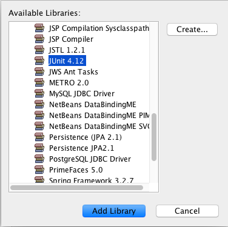

# Configuration NetBeans

Ce chapitre couvre quelques éléments de configuration de NetBeans

## JUnit

Deux librairies à installer:

* JUnit
* Hamcrest

Cliquez bouton droit sur le projet puis Properties > Libraries

Cliquez sur le bouton `Add Library...`

Choisissez la librairie correspondant à `JUnit x.yy` dans la liste:

Cliquez sur `Add Library` puis sur `OK`

Faites de même avec la librairie Hamcrest
