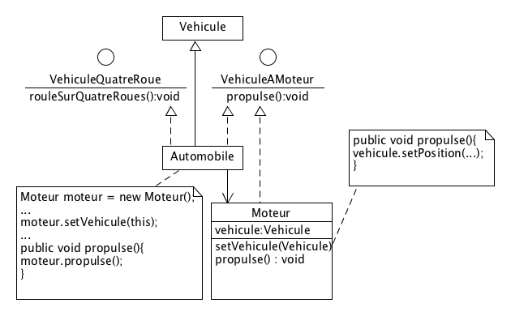
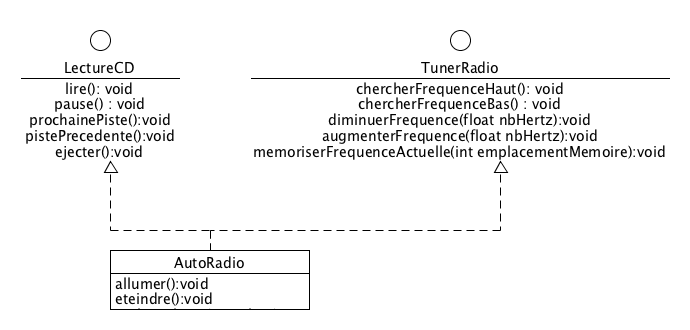
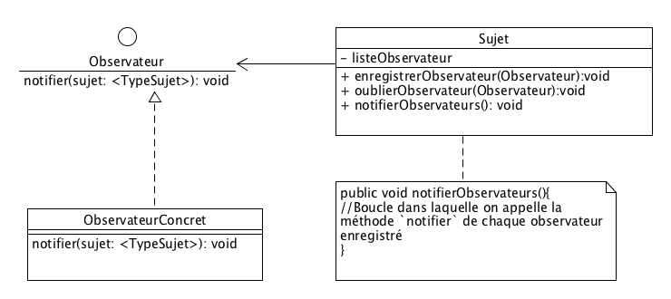

# Travailler avec les objets

## Interfaces

Les interfaces permettent de réaliser un "héritage multiple". C'est-à-dire, pour une classe d'avoir plusieurs classes parentes.

En effet, en Java, l'héritage multiple n'est pas possible. Vous ne trouverez jamais ce genre de chose:


Et c'est tant mieux !

Il existe bien d'autres moyens de partager des fonctionnalités entre des classes différentes.

Les interfaces en Java permettent de définir une liste de fonctionnalités que fournira une classe.

Ce sont des classes *totalement abstraites*


En Java, une classe *implémente* une interface mais n'en hérite pas.

Donc, l'inconvénient est qu'il faut réimplémenter la méthode de l'interface dans la classe.

Heureusement, on peut (par exemple) utiliser ce type de conception afin de réutiliser le code de la classe `Moteur`:




### L'interface entre deux domaines

Si on prend l'exemple d'un ordinateur, on pourra le brancher au secteur électrique quel que soit le pays où l'on se trouve. L'interface entre l'ordinateur et le réseau est multiple et se fait grâce à un adaptateur secteur.

Ce même adaptateur possède plusieurs interfaces interchangeables permettant de le brancher à une prise électrique. Et cette prise de courant est une interface vers l'alimentation électrique présente dans le bâtiment.

L'interface ici est le câble. C'est le lien entre l'appareil électrique et le réseau électrique.


### Utilisation des interfaces en Java

#### Déclaration
```java
public interface VehiculeAMoteur {
  public void propulse();
}

```

#### Implémentation
```java
class Automobile implements VehiculeAMoteur, VehiculeAQuatreRoues{
  //...
}

```


Voir le cours [https://en.wikibooks.org/wiki/Java_Programming/Interfaces](https://en.wikibooks.org/wiki/Java_Programming/Interfaces)


### Application
Prenons un autre exemple concret: un autoradio.

Un autoradio  :
* permet d'écouter la radio: il fournira une interface (des boutons) permettant de régler la station d'écoute et de mémoriser certaines fréquences
* fournit des commandes de base:
* * régler le volume
* * allumer/éteindre
* écouter un CD:
* * il fournit un lecteur (une interface d'accès entre les données stockées sur un CD et l'appareil)
* * des boutons permettant de naviguer et commander la lecture/pause/éjection du CD
* lire une clef USB contenant des MP3

Chaque item principal ci-dessus peut être représenté sous la forme d'une interface.





Ce qui est important ici est qu'une classe donnée puisse être vue comme pouvant avoir plusieurs fonctionnalités regroupées par thème (une interface <=> un thème).

#### Ecriture du code

Créez une classe `Autoradio` qui implémente ces deux interfaces.

Un menu affichera le statut de l'instance d'`Autoradio`. Par exemple:

```
Lecture de la piste 3 du CD
```

ou

```
Ecoute de la radio FM : 102.3MHz
```
Le menu permettra de changer de mode:

```
R. passage au mode Radio
C. passage au mode CD
```

Il affichera les fonctions disponibles à activer:

```
1. Augmenter volume
2. Diminuer volume
3. Passer au mode Tuner
4. Passer au mode CD


1. Morceau CD suivant
2. Morceau CD précédent

```

Le choix d'un des nombres fera appel à une des méthodes de l'interface correspondante.

Réalisez le diagramme d'activité correspondant.

Ecrivez le code des interfaces permettant de réaliser les fonctions *Tuner* et *Lecteur CD*

Chaque méthode, au moment de son appel fera un affichage dans la console.

```
Bouton morceau suivant appuyé
Bouton volume modifié: niveau 4
```


#### Lecteur MP3

Modélisez et codez l'interface de lecture des MP3 : `LecteurMP3`

Ajoutez cette interface à une sous-classe de la classe `Autoradio` : la classe `AutoradioMP3`.

Implémentez les méthodes correspondantes.

Vous modifierez la méthode permettant d'afficher le menu de la classe `Autoradio` (et pas celle de la classe `AutoradioMP3` pour afficher les éléments correspondants à l'interface `LecteurMP3`

Et ce uniquement si elle est implémentée par l'instance de l'objet en cours.

Pour tester cela, vous utiliserez le mot-clé `instanceof` :

```java
if (this instanceof LecteurMP3){
  afficherMenuMP3();
}

```

#### Format des fichiers Audio

Les formats de fichiers audio possible sur une clef USB sont:
* MP3
* OggVorbis
* WMA
* AAC

Faites une modélisation UML puis codez la prise en compte de ces formats.

### Le modèle de conception Observateur

Un des modèles de conception permettant à un objet de notifier les changements qu'il subit sans "connaître" les objets intéressés par ces changements est le modèle *Observateur* (*Observer*).



#### Exemple

Reprenons nos classes Champs et Fleur. Nous allons créer une classe Nature qui sera notifiée lorsque son instance de Champs recevra une nouvelle fleur.

##### Classe ObservateurChamps
```java
public interface ObservateurChamps {
	/**
	 * Appelé quand le champs passé en paramètre a été modifié
	 * @param champs
	 */
	public void champsModifie(Champs champs) ;
}

```

##### Classe Champs
```java
package fr.viacesi.pau.ap2017.nature;

import java.util.List;
import java.util.ArrayList;

public class Champs {
	@SuppressWarnings("rawtypes")
	private List mesObjets = new ArrayList();
	private ObservateurChamps[] observateurs = new ObservateurChamps[10];
	private int observateursCompteur = 0;


	@SuppressWarnings("unchecked")
	public void addObjet(Object o){
		mesObjets.add(o);
		notifierObservateurs();
	}

	public String toString(){
		String valeur = "Champ [";
		for (Object o : mesObjets) {
			valeur += o.toString();
		}
		return valeur +"]" ;
	}

	public void enregistrerObservateur(ObservateurChamps obs){
		observateursCompteur++;
		observateurs[observateursCompteur] = obs;
	}
	public void oublierObservateur(ObservateurChamps obs){
		//...
	}
	public void notifierObservateurs(){
		for (int i = 0; i < observateurs.length; i++) {
			if(observateurs[i] != null){
				observateurs[i].champsModifie(this);
			}
		}
	}
}
```

##### Classe Fleur

```java
public class Fleur {
	private String nom ;
	private int identifiant ;

	public Fleur(String nom, int identifiant){
		this.nom = nom;
		this.identifiant = identifiant ;
	}
	public String toString(){
		return nom+"("+identifiant+")" ;
	}
}

```

##### Nature
```java
package fr.viacesi.pau.ap2017.nature;

public class Nature implements ObservateurChamps {
	private Champs champs ;
	Nature(){
		champs = new Champs();
		champs.enregistrerObservateur(this);
	}

	@Override
	public void champsModifie(Champs champs) {
		System.out.println("Le champs a été modifié");
		System.out.println(champs);
	}

	public static void main(String[] args) {
		Nature nature = new Nature();
		nature.champs.addObjet(new Fleur("Paquerette", 1));
		nature.champs.addObjet(new Fleur("Jonquille", 2));
	}

}

```

##### Exécution
L'exécution de ce code donne:
```
Le champs a été modifié
Champ [Paquerette(1)]
Le champs a été modifié
Champ [Paquerette(1)Jonquille(2)]
```

#### Application

Reprenez le code des classes `Date` et `ValiditeDate`.  Adaptez y un observateur (`ObservateurDate`) et faites en sorte que tout changement d'une instance de `Date` affiche un message sur la console.


## Exceptions
Prochain chapitre: [Exceptions.md](Exceptions.md)
